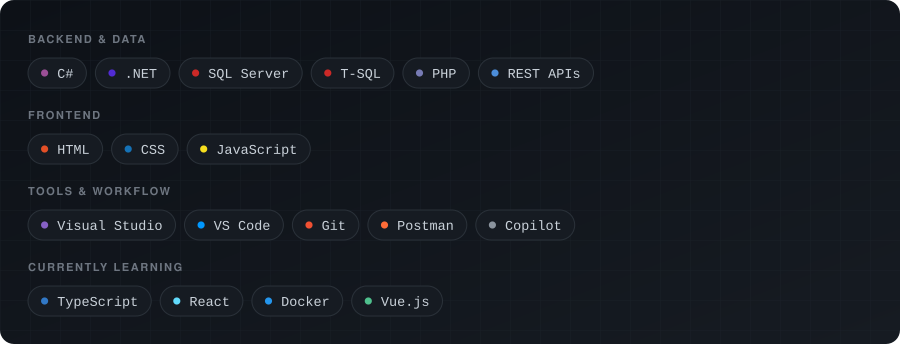

<!--
  Max Exner — GitHub Profile README
  Grafiken liegen unter assets/ und gehoeren zu diesem Repo.
  Stack aendern: tools/build-stack-svg.py bearbeiten und ausfuehren.
-->

<div align="center">

<picture>
  <source media="(max-width: 600px) and (prefers-color-scheme: dark)" srcset="assets/banner-mobile-dark.svg">
  <source media="(max-width: 600px)" srcset="assets/banner-mobile-light.svg">
  <source media="(prefers-color-scheme: dark)" srcset="assets/banner-dark.svg">
  <source media="(prefers-color-scheme: light)" srcset="assets/banner-light.svg">
  
</picture>

<br>

<a href="https://exnermax.de"></a><a href="https://linkedin.com/in/exnermax"></a><a href="mailto:business@exnermax.com"></a><a href="https://x.com/exnermax"></a>
</div>

<picture>
  <source media="(prefers-color-scheme: dark)" srcset="assets/divider-dark.svg">
  <source media="(prefers-color-scheme: light)" srcset="assets/divider-light.svg">
  
</picture>

## `whoami`

```csharp
namespace Exner.Dev;

public sealed record Developer
{
    public string   Name     => "Max Exner";
    public string   Location => "Germany";
    public string   Role     => "Software Developer";

    public string[] Focus    => ["ERP Systems", "Backend", "API Integration", "Automation"];
    public string[] Stack    => ["C#", ".NET", "SQL", "PHP", "JavaScript"];
    public string[] Learning => ["TypeScript", "React", "Docker", "Vue.js"];

    public string   Contact  => "business@exnermax.com";
}
```

Ich baue die Systeme, die im Hintergrund laufen: ERP-Prozesse, interne Tools und
die Schnittstellen dazwischen. Meistens C# und SQL, oft PHP, immer mit dem Ziel,
dass am Ende weniger von Hand gemacht werden muss.

<picture>
  <source media="(prefers-color-scheme: dark)" srcset="assets/divider-dark.svg">
  <source media="(prefers-color-scheme: light)" srcset="assets/divider-light.svg">
  
</picture>

## Tech Stack

<picture>
  <source media="(prefers-color-scheme: dark)" srcset="assets/stack-dark.svg">
  <source media="(prefers-color-scheme: light)" srcset="assets/stack-light.svg">
  
</picture>

<picture>
  <source media="(prefers-color-scheme: dark)" srcset="assets/divider-dark.svg">
  <source media="(prefers-color-scheme: light)" srcset="assets/divider-light.svg">
  
</picture>

## Get in touch

<div align="center">

**Immer offen für spannende Projekte, Kollaborationen oder einen guten Tech-Talk.**

<br>

<a href="https://exnermax.de"></a><a href="mailto:business@exnermax.com"></a><a href="https://github.com/exnermax/exnermax/issues"></a>
</div>

<picture>
  <source media="(prefers-color-scheme: dark)" srcset="assets/divider-dark.svg">
  <source media="(prefers-color-scheme: light)" srcset="assets/divider-light.svg">
  
</picture>
